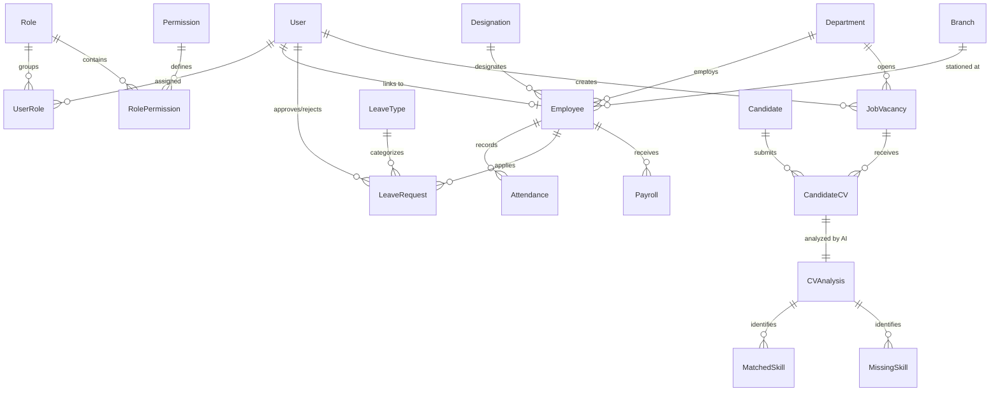

# 🏢 HRM ERP & AI Recruitment Intelligence System
### *Enterprise Human Resource Management, Automated Payroll, and AI-Powered Resume Screening*

[](https://www.python.org/)
[](https://www.djangoproject.com/)
[](https://sqlite.org/)
[](https://platform.openai.com/)
[](https://developer.mozilla.org/)
[](#-license--disclaimer)

---

## 📌 Project Overview & Executive Summary

The **HRM ERP & AI Recruitment Intelligence System** is an enterprise-grade web application developed as an **Internship Capstone Project**. It streamlines and centralizes the entire employee lifecycle—from initial recruitment and AI-assisted CV evaluation to onboarding, attendance tracking, leave requests, performance, and monthly payroll computation.

### The Problem It Solves
Traditional organizational HR operations suffer from disconnected spreadsheets, manual attendance registers, delayed leave approval pipelines, error-prone salary calculations, and high recruiter burnout during candidate screening. 

### The Solution
This HRM ERP establishes a unified single-source-of-truth platform built on Django's robust Model-View-Template (MVT) architecture. It incorporates:
1. **Strict Role-Based Access Control (RBAC)** across **System Administrators**, **HR Managers**, and **General Employees**.
2. **Automated Operational Workflows** for check-in/out, overtime calculation, attendance policy enforcement, leave approvals, and payslip generation.
3. **AI-Powered Recruitment Intelligence** utilizing Large Language Models (LLM) and NLP parsing to evaluate uploaded candidate resumes (PDF/DOCX) objectively against job specifications under strict non-discrimination guidelines.
4. **Modern Glassmorphic User Interface** built with pure semantic HTML5, custom CSS design tokens, responsive layouts, and an integrated Dark / Light mode toggle.

---

## 🎓 Internship Project Metadata

| Attribute | Project Specification Details |
|---|---|
| **Project Title** | Enterprise HRM ERP & AI Recruitment Intelligence System |
| **Project Type** | Full-Stack Software Engineering & Applied AI Internship Project |
| **Backend Framework** | Django 5.x (Python 3.10+) |
| **Database** | SQLite3 (Development / Assessment), PostgreSQL compatible |
| **Architecture** | Modular Clean ERP Architecture (7 Domain Apps) |
| **AI Integration** | OpenAI GPT-4o-mini via REST API & PyPDF/Docx text extractors |
| **Frontend UI/UX** | Custom Glassmorphic Design System, Pure CSS3, Vanilla JavaScript |
| **Security Standards** | CSRF Protection, PBKDF2 Password Hashing, Session Management, Role Middleware |
| **Primary Repository** | `HRM/` |

---

## 🌟 Core System Modules & Features

```
                              ┌────────────────────────┐
                              │     HRM ERP System     │
                              └───────────┬────────────┘
                                          │
    ┌──────────────┬──────────────┬───────┴──────┬──────────────┬──────────────┐
    ▼              ▼              ▼              ▼              ▼              ▼
[Accounts &   [Organization  [Employee      [Attendance &   [Leave         [Payroll &     [Recruitment &
    RBAC]       Hierarchy]    Directory]       Policy]      Management]     Payslips]       AI CV Screening]
```

### 1. 🛡️ Authentication & Role-Based Access Control (RBAC)
- **Unified Portal**: A single entry point (`/accounts/login/`) with automated role resolution directing users to their designated dashboard.
- **Three User Roles**:
  - **Admin**: Full system control, user and permission management, system-wide analytics, audit logs.
  - **HR Manager**: Departmental oversight, employee record management, attendance policies, leave approvals, payroll processing, and job vacancy creation.
  - **Employee**: Self-service profile management, daily check-in/check-out, leave request submission, attendance history, and monthly payslip downloads.
- **Custom User Model**: Custom `accounts.User` model coupled with `Role`, `Permission`, `UserRole`, and `RolePermission` tables for granular authorization.
- **Role Security**: Route protection through custom Python view decorators (`@role_required`), mixins, and request-level middleware (`RoleMiddleware`).

### 2. 🏢 Organization Structure
- **Department Management**: Create, view, update, and manage organizational departments (e.g., Engineering, Human Resources, Finance, Sales).
- **Designations**: Define company titles, hierarchies, and responsibilities.
- **Branches**: Multi-location branch configuration with full CRUD capabilities.

### 3. 👥 Employee Lifecycle & Directory
- **Comprehensive Profiles**: Personal demographics, contact info, job title, department, hire date, employment status, emergency contacts, and profile photo uploads.
- **Field-Level Privilege Separation**:
  - **Employee Self-Service**: Can only update contact details, address, personal telephone, and profile photograph.
  - **HR/Admin Guardrails**: Official parameters (Employee ID, Salary, Designation, Department, Status) are strictly read-only for employees and editable solely by authorized HR personnel.
- **Directory Search & Filters**: Instant keyword search, department filtering, designation sorting, and pagination.

### 4. ⏱️ Attendance & Policy Enforcement Engine
- **Self-Service Check-In / Check-Out**: One-click daily attendance logging with automatic timestamp verification.
- **Automated Calculations**: Dynamic computation of total working hours, late minutes, overtime hours, and half-day penalties.
- **Configurable Attendance Policy**: Admin and HR can configure organizational working hours, grace period (e.g., 15 minutes), and half-day thresholds via `/attendance/policy/`.
- **Audit Logs**: Comprehensive logs filterable by date range, department, and attendance status (`Present`, `Late`, `Half Day`, `Absent`, `On Leave`).

### 5. 🏖️ Leave Management & Approval Workflow
- **Custom Leave Types**: Configurable categories (Annual Leave, Casual Leave, Sick Leave, Maternity Leave, Unpaid Leave) with allotted day limits.
- **Application Workflow**: Employees submit requests with date ranges, leave category, and supporting justification.
- **HR Approval Queue**: Dedicated review inbox on the HR Dashboard with single-click **Approve** or **Reject** actions accompanied by mandatory/optional manager comments.
- **Employee Balance Tracking**: Real-time visibility into taken, approved, and pending leave allocations.

### 6. 💰 Payroll & Payslip Engine
- **Salary Computation**:
  $$\text{Net Salary} = (\text{Basic Salary} + \text{Allowances} + \text{Overtime Pay}) - (\text{Deductions} + \text{Tax})$$
- **Monthly Generation**: Bulk or individual monthly payroll generation with month/year tagging (`YYYY-MM`).
- **Data Isolation**: Employees can access only their own payslips, while HR and Admin can review and export payroll across all departments.
- **Printable Payslips**: Formatted, print-ready digital payslips displaying detailed earnings and deduction breakdowns.

### 7. 🤖 AI-Powered Recruitment & CV Intelligence Engine
- **Job Vacancy Specification**: HR defines role title, department, required skills, preferred skills, minimum experience years, and educational requirements.
- **Resume Upload & Text Extraction**: Accepts candidate resumes in `.pdf` or `.docx` formats (up to 5MB) with automated text sanitation and security validation.
- **LLM-Based Matching Engine**: Analyzes candidate text against job specifications using structured prompt engineering with OpenAI models:
  - **Match Score**: 0% to 100% objective fit index.
  - **Recommendation Rating**: Categorized into *Strong Match*, *Moderate Match*, or *Weak Match*.
  - **Skills Gap Analysis**: Explicit breakdown of confirmed matched skills vs. missing requirements.
  - **Experience & Education Verification**: Automated extraction of demonstrated years of experience and academic credentials against job criteria.
- **Ethical & Fair Hiring Safeguards**: Built-in system prompt guidelines strictly forbid evaluating protected demographic traits (gender, age, race, religion, marital status, or photographs).

### 8. 🎨 Glassmorphic UI/UX & Theming
- **Curated Color Palette**: Custom HSL color variables with modern glassmorphic card overlays, blur effects, and smooth transitions.
- **Light & Dark Mode**: Seamless toggle persisted across browser sessions via `localStorage` with system preference auto-detection.
- **Responsive Layout**: Designed for mobile devices, tablets, laptops, and ultra-wide desktop monitors without relying on heavy third-party CSS libraries.

---

## 📐 System Architecture & ERD

### Architectural Pattern: Modular Django MVT
The project follows clean architectural principles by decomposing ERP concerns into seven autonomous apps inside the `apps/` directory:

```
hrm_erp/
├── apps/
│   ├── accounts/          # User model, RBAC, Auth, Multi-Role Dashboards
│   ├── organization/      # Departments, Designations, Branches
│   ├── employees/         # Employee records, Profiles, Photo storage
│   ├── attendance/        # Check-in/out, Shift Policy, Attendance Logs
│   ├── leave_management/  # Leave Types, Applications, Approval Workflow
│   ├── payroll/           # Salary components, Payroll run, Payslips
│   └── recruitment/       # Vacancies, CV uploads, AI Analyzer Engine
```

### Entity-Relationship Diagram (ERD)



---

## 🔐 Role-Based Access Control (RBAC) Matrix

| Functional Module | System Admin | HR Manager | Employee |
|---|:---:|:---:|:---:|
| **Dashboard** | Full System Statistics | HR & Departmental Metrics | Personal Activity & Status |
| **User & Role Management** | ✅ Full CRUD | ❌ No Access | ❌ No Access |
| **Department / Designation / Branch** | ✅ Full CRUD | ✅ Full CRUD | 👁️ View Only |
| **Employee Directory** | ✅ Full CRUD | ✅ Full CRUD | 👁️ View Own Profile |
| **Edit Employee Official Details** | ✅ Allowed | ✅ Allowed | ❌ Forbidden |
| **Edit Personal Contact Details** | ✅ Allowed | ✅ Allowed | ✅ Allowed |
| **Daily Attendance Check-in / Out** | ✅ Allowed | ✅ Allowed | ✅ Allowed (Own) |
| **Configure Attendance Policy** | ✅ Full Access | ✅ Full Access | 👁️ Read-Only |
| **Submit Leave Request** | ✅ Allowed | ✅ Allowed | ✅ Allowed |
| **Approve / Reject Leave Applications**| ✅ Full Access | ✅ Full Access | ❌ Forbidden |
| **Process Monthly Payroll** | ✅ Full Access | ✅ Full Access | ❌ Forbidden |
| **Download / View Payslips** | ✅ All Employees | ✅ All Employees | 👁️ Own Payslips Only |
| **Create Job Vacancy** | ✅ Allowed | ✅ Allowed | ❌ Forbidden |
| **Upload Candidate CV & Run AI Match** | ✅ Allowed | ✅ Allowed | ❌ Forbidden |

---

## 💻 Technology Stack

| Domain | Technology / Library | Purpose |
|---|---|---|
| **Programming Language** | Python 3.10+ | Core server-side programming language |
| **Web Framework** | Django 5.x | Web application framework (MVC/MVT pattern) |
| **Database** | SQLite 3 (Dev) / PostgreSQL (Prod) | Relational database management system |
| **AI / Machine Learning** | OpenAI API (`gpt-4o-mini`) | Resume analysis, semantic matching, skills gap scoring |
| **Document Processing** | `pypdf`, `python-docx` | PDF and DOCX binary resume text extraction |
| **Image Processing** | `Pillow` (PIL) | Employee profile photo processing and validation |
| **Environment Management** | `python-dotenv` | Twelve-factor app environment variable isolation |
| **Styling & Presentation** | Modern CSS3 (Variables, Grid, Flexbox) | Pure custom glassmorphism design system |
| **Client-side Scripting** | Vanilla JavaScript (ES6+) | Theme toggle, interactive modals, dynamic AJAX calls |

---

## 🚀 Step-by-Step Installation & Setup Guide

Follow these instructions to clone, configure, and execute the project from source on a clean PC.

### 1. Prerequisites
Ensure you have the following installed on your system:
- **Python 3.10 or higher**: [Download from python.org](https://www.python.org/downloads/) *(Make sure to check "Add Python to PATH")*
- **Git**: [Download Git](https://git-scm.com/)

---

### 2. Clone the Repository & Enter Folder
```bash
git clone <your-repository-url>
cd HRM
```

---

### 3. Create & Activate a Python Virtual Environment

#### On Windows (PowerShell):
```powershell
python -m venv venv
.\venv\Scripts\Activate.ps1
```
*(If PowerShell shows a script execution error, run: `Set-ExecutionPolicy -Scope Process -ExecutionPolicy Bypass` and re-run)*

#### On Windows (Command Prompt - cmd):
```cmd
python -m venv venv
venv\Scripts\activate.bat
```

#### On macOS / Linux:
```bash
python3 -m venv venv
source venv/bin/activate
```

*(Once activated, your terminal prompt will display `(venv)`)*

---

### 4. Install Project Dependencies
Install all required Python packages:
```bash
pip install --upgrade pip
pip install -r requirements.txt
```

*(Optional: If working directly inside `hrm_erp/`, you can also run `pip install -r hrm_erp/requirements.txt`)*

---

### 5. Configure Environment Variables (`.env`)
Navigate to the Django project folder `hrm_erp/`:
```bash
cd hrm_erp
```

Create or verify a file named `.env` in the `hrm_erp/` directory with the following variables:

```ini
# Security
SECRET_KEY=django-insecure-hrm-erp-internship-dev-key-2026
DEBUG=True
ALLOWED_HOSTS=localhost,127.0.0.1

# AI Recruitment Module (Optional for general ERP, required for AI CV Screening)
OPENAI_API_KEY=your-openai-api-key-here
OPENAI_MODEL=gpt-4o-mini

# Google Gemini API (HR AI Assistant & Copilot)
GEMINI_API_KEY=your-gemini-api-key-here
GEMINI_MODEL=gemini-1.5-flash

# Firebase Service Account (Optional)
FIREBASE_SERVICE_ACCOUNT_KEY=
```

---

### 6. Apply Database Migrations
Create the SQLite database schema and generate all tables:
```bash
python manage.py migrate
```

---

### 7. Seed Initial Roles & Demo Accounts
The project includes a custom management command that automatically provisions default roles (`Admin`, `HR Manager`, `Employee`), default permissions, standard attendance policies, sample leave types, and pre-configured demo users:

```bash
python manage.py seed_admin
```

---

### 8. Run Automated Unit Tests
Verify the installation by running the test suite:
```bash
python manage.py test
```
*(All tests should complete with `OK`)*

---

### 9. Launch the Development Server
Start the local web server:
```bash
python manage.py runserver 127.0.0.1:8000
```

Open your browser and navigate to:
👉 **[http://127.0.0.1:8000/](http://127.0.0.1:8000/)**

---

## 🔑 Pre-Configured Demo Credentials

Use any of the seeded credentials below to explore the distinct role permissions and dashboards:

| Role | Username | Password | Accessible Dashboard & Features |
|---|---|---|---|
| 🛡️ **System Admin** | `admin` | `admin123` | Full access: Users, Roles, Attendance, Org CRUD, Payroll, Policy, System Audit |
| 💼 **HR Manager** | `hr_manager` | `hr123` | Employee Profiles, Attendance Policies, Leave Approval, Payroll Processing, AI Vacancies |
| 👤 **Employee** | `employee` | `emp123` | Self-Service Check-in/out, Profile Edit (Contact/Photo), Leave Application, Payslip View |

*(Note: New users can also register via the **Sign Up** link on the login page.)*

---

## 📁 Project Directory Structure

```text
HRM/
├── requirements.txt                   # Top-level dependencies file
├── README.md                          # Comprehensive project documentation
├── task.md                            # Development milestone tracking
├── venv/                              # Isolated Python virtual environment
└── hrm_erp/                           # Primary Django Project Root
    ├── manage.py                      # Django CLI management utility
    ├── db.sqlite3                     # SQLite relational database
    ├── .env                           # Local environment configuration
    ├── .env.example                   # Template environment configuration
    ├── requirements.txt               # Module dependencies
    │
    ├── config/                        # Core Project Configuration
    │   ├── __init__.py
    │   ├── settings.py                # Installed apps, DB, static/media, auth
    │   ├── urls.py                    # Root URL router
    │   ├── asgi.py                    # ASGI server gateway
    │   └── wsgi.py                    # WSGI server gateway
    │
    ├── apps/                          # Modular Django Applications
    │   ├── accounts/                  # Authentication, Custom User, RBAC & Dashboards
    │   │   ├── models.py              # User, Role, Permission, UserRole, RolePermission
    │   │   ├── views.py               # Login, Logout, Register, Profile, Dashboards
    │   │   ├── permissions.py         # Role decorators (@role_required) & helpers
    │   │   ├── middleware.py          # Role injection into request pipeline
    │   │   └── management/commands/   # seed_admin data initialization command
    │   │
    │   ├── organization/              # Department, Designation, and Branch Management
    │   │   ├── models.py              # Department, Designation, Branch models
    │   │   └── views.py               # CRUD views and JSON modal endpoints
    │   │
    │   ├── employees/                 # Employee Directory & Lifecycle
    │   │   ├── models.py              # Employee profile data model
    │   │   ├── forms.py               # Role-restricted forms (Self vs HR/Admin)
    │   │   └── views.py               # Employee listing, profile edit, details
    │   │
    │   ├── attendance/                # Check-In/Out & Shift Policy Engine
    │   │   ├── models.py              # Attendance and AttendancePolicy models
    │   │   ├── views.py               # Quick check-in/out, logs, policy config
    │   │   └── services.py            # Hours, overtime & late minute calculations
    │   │
    │   ├── leave_management/          # Leave Requests & Approval Workflows
    │   │   ├── models.py              # LeaveType, LeaveRequest models
    │   │   └── views.py               # Leave submission, review, approval/rejection
    │   │
    │   ├── payroll/                   # Payroll Processing & Payslips
    │   │   ├── models.py              # Monthly Payroll records
    │   │   └── views.py               # Batch payroll computation, payslip view/print
    │   │
    │   └── recruitment/               # Vacancies, CV Uploads & AI Intelligence
    │       ├── models.py              # JobVacancy, CandidateCV, CVAnalysis, MatchedSkill
    │       ├── forms.py               # Vacancy and CV upload validation forms
    │       ├── views.py               # Vacancies, screening dashboard, candidate ranking
    │       └── services/
    │           ├── cv_extractor.py    # PDF and DOCX text extraction and sanitization
    │           └── ai_analyzer.py     # OpenAI prompt engineering & structured JSON parser
    │
    ├── templates/                     # Glassmorphic Semantic HTML5 Templates
    │   ├── base.html                  # Master template with navigation and theme toggle
    │   ├── auth/                      # Login, Registration, Password Reset pages
    │   ├── dashboard/                 # admin.html, hr.html, employee.html
    │   ├── organization/              # Department, designation, branch templates
    │   ├── employees/                 # Employee list, detail, profile edit forms
    │   ├── attendance/                # Attendance logs, policy configuration
    │   ├── leave_management/          # Leave application, review queues
    │   ├── payroll/                   # Payroll processing, digital payslips
    │   └── recruitment/               # Vacancies, CV upload, AI analysis reports
    │
    ├── static/                        # Frontend Static Assets
    │   ├── css/
    │   │   ├── style.css              # Core design tokens, glassmorphism, components
    │   │   ├── theme.css              # Dark mode / Light mode color variables
    │   │   └── responsive.css         # Breakpoints and mobile navigation styling
    │   └── js/
    │       ├── theme-toggle.js        # Dark/Light mode persistence script
    │       └── main.js                # Modal handlers, alerts, interactive elements
    │
    └── media/                         # Dynamic Uploads (Git Ignored)
        ├── profile_photos/            # Employee avatar photographs
        └── cv_uploads/                # Candidate PDF/DOCX resume files
```

---

## 🌐 Complete URL & Routing Reference

| Path | View / Controller | Allowed Roles | Description |
|---|---|:---:|---|
| `/` | `RedirectView` | Public | Redirects automatically to `/accounts/login/` |
| `/accounts/login/` | `accounts.views.login_view` | Public | Authentication portal with role redirect |
| `/accounts/register/` | `accounts.views.register_view` | Public | New user sign-up page |
| `/accounts/logout/` | `accounts.views.logout_view` | Authenticated | Clears user session |
| `/dashboard/` | `accounts.views.dashboard_redirect`| Authenticated | Routes user to their role-specific dashboard |
| `/dashboard/admin/` | `accounts.views.admin_dashboard` | Admin | System-wide statistics and management hubs |
| `/dashboard/hr/` | `accounts.views.hr_dashboard` | HR, Admin | HR analytics, leave queues, quick actions |
| `/dashboard/employee/` | `accounts.views.employee_dashboard`| Employee | Personal attendance, quick check-in, payslips |
| `/organization/departments/` | `organization.views.department_list`| HR, Admin | Department management |
| `/employees/` | `employees.views.employee_list` | HR, Admin | Searchable employee directory |
| `/employees/profile/` | `employees.views.employee_profile` | All Roles | Profile view (role-restricted fields) |
| `/attendance/check-in/` | `attendance.views.check_in` | All Roles | Timestamped check-in |
| `/attendance/check-out/` | `attendance.views.check_out` | All Roles | Timestamped check-out with hour calculation |
| `/attendance/policy/` | `attendance.views.attendance_policy`| HR, Admin (Edit), Emp (View)| Shift & grace period rules |
| `/leave/request/create/` | `leave_management.views.request_create`| All Roles | Submit leave application |
| `/leave/review/<id>/` | `leave_management.views.request_review`| HR, Admin | Approve or reject leave request |
| `/payroll/` | `payroll.views.payroll_list` | HR, Admin | Monthly salary overview & payroll batch run |
| `/payroll/payslip/<id>/` | `payroll.views.payslip_view` | Owner, HR, Admin | Digital printable employee payslip |
| `/recruitment/vacancies/` | `recruitment.views.vacancy_list` | HR, Admin | Active job openings & postings |
| `/recruitment/vacancies/<id>/upload-cv/`| `recruitment.views.upload_cv` | HR, Admin | Upload CV for AI evaluation |
| `/recruitment/analysis/<id>/` | `recruitment.views.analysis_detail` | HR, Admin | Detailed AI skills match report |

---

## 🧪 Quality Assurance & Test Verification

The project includes an automated test suite verifying role authorization, data isolation, model integrity, and operational calculations.

To execute tests:
```bash
python manage.py test
```

### Key Areas Covered by Tests:
1. **Authentication & Access Isolation**: Ensures employees cannot access `/dashboard/admin/` or view peer payroll records.
2. **Attendance Service Calculations**: Tests boundary conditions for on-time arrival, grace periods, late penalties, and overtime computation.
3. **Leave Workflow Verification**: Verifies status transitions (`Pending` $\rightarrow$ `Approved`/`Rejected`) and approval audit logging.
4. **File Validation**: Validates file extension restrictions (.pdf, .docx only) and file size limits (5MB max) for CV uploads.
5. **AI Evaluation Integrity**: Confirms structured JSON parsing and graceful error fallback if external API calls encounter network timeouts.

---

## 🔒 Security Best Practices Implemented

- **CSRF Protection**: All form submissions enforce Django's cryptographic `` tokens.
- **Data Isolation at Model Layer**: Employee queries enforce filtering by `request.user.employee` to prevent horizontal privilege escalation.
- **SQL Injection Prevention**: Uses Django ORM parameterized queries exclusively without unsafe raw SQL string formatting.
- **Secure Password Storage**: Built-in PBKDF2 with SHA-256 algorithm and salt hashing.
- **File Upload Hardening**: Validates mime-types, file sizes, and renames uploaded files to prevent directory traversal vulnerabilities.
- **Session Expiry**: 24-hour session limits with `SESSION_SAVE_EVERY_REQUEST` enabled.

---

## 📈 Future Roadmap & Production Enhancements

- [ ] **Database Migration**: Switch database backend from SQLite to PostgreSQL with connection pooling.
- [ ] **Asynchronous Task Queue**: Integrate Celery and Redis to process AI CV evaluations and bulk payslip PDF generation asynchronously in the background.
- [ ] **Biometric Hardware Integration**: Webhook receiver for ZKTeco / RFID biometric hardware check-in terminals.
- [ ] **Automated Email Notifications**: SMTP integration for instant leave approval/rejection emails and monthly payslip dispatch.
- [ ] **Export Options**: One-click Excel/CSV and PDF export for attendance sheets and payroll summaries.

---

## 👥 Contributors & Acknowledgements

- **Internship Candidate**: [Your Name / Student ID]
- **Institutional / Company Mentor**: [Supervisor / Lead Name]
- **Academic Program**: [Degree / Internship Program Details]
- **Department**: Department of Computer Science & Engineering / Information Technology

Special thanks to the open-source communities behind **Django**, **Python**, and **OpenAI** for providing foundational tools and documentation.

---

## 📄 License & Disclaimer

This project was engineered for academic demonstration and internal corporate HR evaluation. All rights reserved. Code may be used, evaluated, and extended for internship capstone assessment.


command

.\venv\Scripts\activate; pip install -r requirements.txt
cd hrm_erp
python manage.py runserver